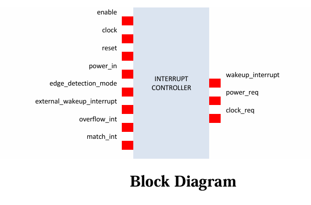
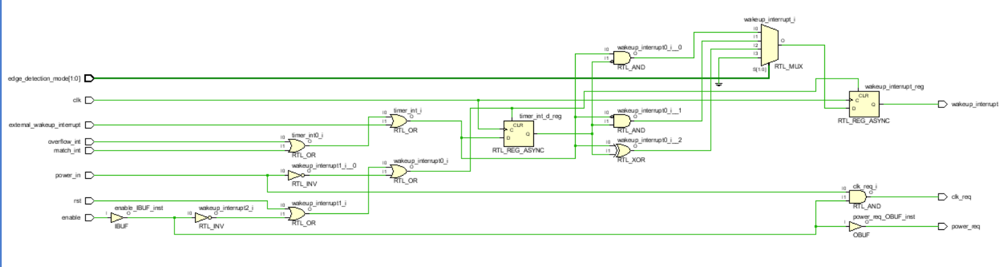
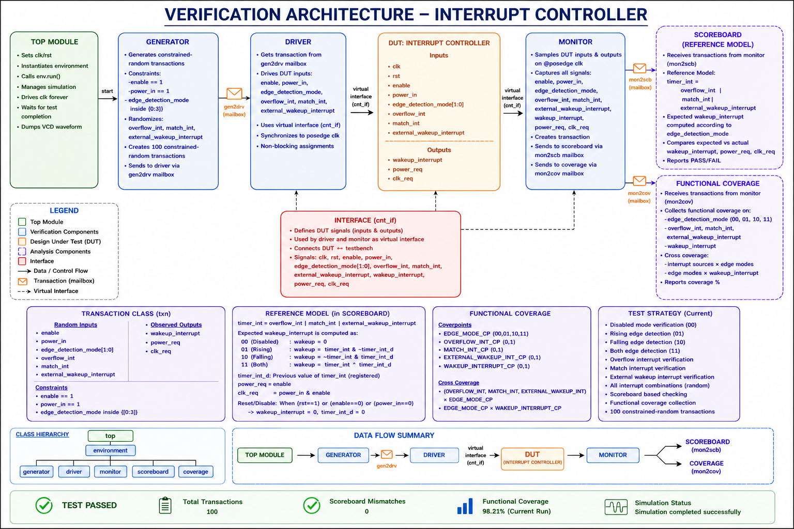
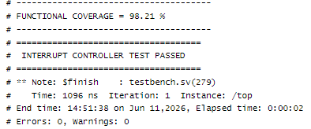
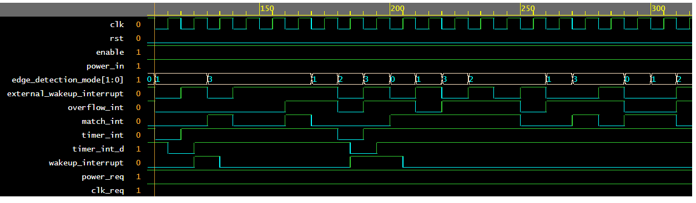
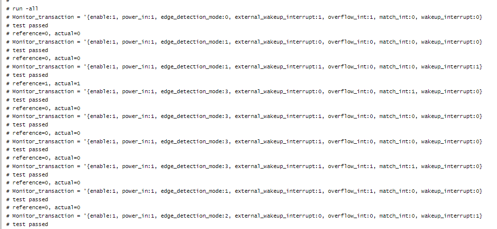

# Interrupt Controller Verification Environment using SystemVerilog

## Project Overview

This project presents the design verification of an Interrupt Controller using a self-checking SystemVerilog verification environment. The Interrupt Controller is responsible for aggregating multiple interrupt sources and generating a wakeup interrupt based on programmable edge detection modes.

The verification environment was developed using constrained-random verification techniques and includes Generator, Driver, Monitor, Scoreboard, Functional Coverage, Mailboxes, and Virtual Interface connectivity.

The objective of this project is to verify the functional correctness of the Interrupt Controller RTL under various interrupt conditions and edge detection configurations.

---

## Project Objectives

* Verify interrupt aggregation functionality.
* Verify wakeup interrupt generation.
* Verify programmable edge detection modes.
* Verify power request and clock request generation.
* Implement a self-checking verification environment.
* Achieve high functional coverage using constrained-random testing.
* Validate DUT functionality with zero scoreboard mismatches.

---

# Design Features

## Interrupt Aggregation

The controller combines multiple interrupt sources into a single internal interrupt signal.

Interrupt Sources:

* overflow_int
* match_int
* external_wakeup_interrupt

Combined Interrupt Logic:

timer_int = overflow_int | match_int | external_wakeup_interrupt

This allows multiple interrupt sources to be handled through a common interrupt mechanism.

---

## Edge Detection Modes

The controller supports programmable edge detection modes.

| Mode | Function               |
| ---- | ---------------------- |
| 00   | Disabled               |
| 01   | Rising Edge Detection  |
| 10   | Falling Edge Detection |
| 11   | Both Edge Detection    |

Wakeup interrupt generation depends on the selected edge detection mode.

---

## Power Management Logic

Power Request Logic:

power_req = enable

Clock Request Logic:

clk_req = power_in & enable

These outputs support power-aware system operation.

---

## Reset Behavior

The controller clears internal state under the following conditions:

* rst = 1
* enable = 0
* power_in = 0

The following signals are reset:

* wakeup_interrupt
* timer_int_d

This ensures deterministic startup behavior.

---

# Block Diagram

The block diagram illustrates the top-level Interrupt Controller architecture and signal connectivity.

Inputs:

* clk
* rst
* enable
* power_in
* edge_detection_mode[1:0]
* overflow_int
* match_int
* external_wakeup_interrupt

Outputs:

* wakeup_interrupt
* power_req
* clk_req

---

# RTL Schematic

The synthesized RTL schematic of the Interrupt Controller is shown below.

The schematic illustrates:

* Interrupt aggregation logic
* Edge detection logic
* Register implementation
* Multiplexer selection logic
* Power and clock request generation

Detailed schematic:

[Interrupt_Controller_Schematic.pdf](Interrupt_Controller_Schematic.pdf)

---

# Verification Architecture

A layered verification architecture was developed using SystemVerilog.

Verification Components:

* Generator
* Driver
* Virtual Interface
* DUT (Interrupt Controller)
* Monitor
* Scoreboard
* Functional Coverage

Communication Mechanisms:

* gen2drv mailbox
* mon2scb mailbox
* mon2cov mailbox

Verification Architecture Diagram:

---

# Verification Flow

The overall verification flow is shown below:

Top Module
↓

Generator
↓ gen2drv mailbox

Driver
↓ virtual interface

Interrupt Controller DUT
↓

Monitor
↙      ↘

Scoreboard     Functional Coverage

The Generator creates constrained-random transactions and sends them to the Driver.

The Driver applies stimulus to the DUT through a virtual interface.

The Monitor samples DUT inputs and outputs and forwards observed transactions to the Scoreboard and Coverage components.

The Scoreboard computes expected behavior and compares it with actual DUT outputs.

Functional Coverage tracks verification completeness.

---

# Verification Components

## Generator

Responsibilities:

* Creates transaction objects.
* Applies constrained randomization.
* Generates 100 constrained-random transactions.
* Sends transactions to Driver through gen2drv mailbox.

Constraints:

* enable == 1
* power_in == 1
* edge_detection_mode inside {[0:3]}

---

## Driver

Responsibilities:

* Receives transactions from Generator.
* Drives DUT inputs.
* Uses virtual interface connectivity.
* Synchronizes stimulus with clock.
* Applies interrupt combinations to DUT.

Driven Signals:

* enable
* power_in
* edge_detection_mode
* overflow_int
* match_int
* external_wakeup_interrupt

---

## Monitor

Responsibilities:

* Samples DUT inputs and outputs.
* Captures actual DUT behavior.
* Creates monitored transactions.
* Sends transactions to Scoreboard.
* Sends transactions to Functional Coverage.

Observed Signals:

Inputs:

* enable
* power_in
* edge_detection_mode
* overflow_int
* match_int
* external_wakeup_interrupt

Outputs:

* wakeup_interrupt
* power_req
* clk_req

---

## Scoreboard

The Scoreboard acts as the reference model.

Reference Interrupt Logic:

timer_int = overflow_int | match_int | external_wakeup_interrupt

The Scoreboard computes the expected wakeup_interrupt according to the selected edge detection mode.

Verification Modes:

* Disabled Mode
* Rising Edge Mode
* Falling Edge Mode
* Both Edge Mode

The Scoreboard compares:

Expected Output

vs

Actual DUT Output

Result:

* PASS
* FAIL

Any mismatch is automatically reported.

---

## Functional Coverage

Functional Coverage measures verification completeness.

Coverage Items:

### Edge Detection Modes

* Disabled (00)
* Rising Edge (01)
* Falling Edge (10)
* Both Edge (11)

### Interrupt Sources

* overflow_int
* match_int
* external_wakeup_interrupt

### Wakeup Interrupt

* 0
* 1

### Cross Coverage

* Interrupt Sources × Edge Modes
* Edge Modes × Wakeup Interrupt

This ensures all important scenarios are exercised.

---

# Source Files

RTL Source:

* RTLSV

Testbench Source:

* Testbench.SV

# Project Documentation

## RTL Verification Specification

[Interrupt_Controller_RTL_Verification_Specification.pdf](Interrupt_Controller_RTL_Verification_Specification.pdf)

This document contains:

- Project overview
- Interrupt controller functionality
- Edge detection modes
- Verification architecture
- Generator, Driver, Monitor, Scoreboard
- Functional coverage plan
- Verification results

---

## RTL Schematic Document

[Interrupt_Controller_Schematic.pdf](Interrupt_Controller_Schematic.pdf)

This document contains:

- Synthesized RTL schematic
- Internal logic implementation
- Register structure
- Interrupt aggregation logic
- Edge detection circuitry
- Output generation logic

Images:

* Block_Diagram.png
* Verification_Architecture.png
* Coverage_Output.png
* Waveform.png
* Output.png

---

# Functional Coverage Report

The functional coverage report generated during simulation is shown below.

Coverage Achieved:

98.21%

This indicates that nearly all functional scenarios were exercised during simulation.

Verification Status:

PASS

---

# Results Summary

| Metric                | Result |
| --------------------- | ------ |
| Transactions          | 100    |
| Functional Coverage   | 98.21% |
| Scoreboard Mismatches | 0      |
| Verification Status   | PASS   |

---

# Waveform Analysis

The simulation waveform is shown below.

Waveform Verification Includes:

* Interrupt aggregation
* Rising edge detection
* Falling edge detection
* Both edge detection
* Wakeup interrupt generation
* Power request generation
* Clock request generation

The waveform confirms correct DUT behavior.

---

# Simulation Results

Simulation output is shown below.

Results:

* 100 constrained-random transactions executed
* Self-checking verification environment
* Zero scoreboard mismatches
* Functional coverage achieved
* All test cases passed successfully
  
---

# Key Verification Concepts Used

* SystemVerilog
* Object-Oriented Programming (OOP)
* Constrained Random Verification
* Mailbox Communication
* Virtual Interface
* Generator-Driver-Monitor Architecture
* Self-Checking Scoreboard
* Functional Coverage
* Cross Coverage
* RTL Verification Methodology

---

# Conclusion

The Interrupt Controller RTL was successfully verified using a constrained-random, self-checking SystemVerilog verification environment.

The verification environment includes Generator, Driver, Monitor, Scoreboard, Functional Coverage, Mailbox communication, and Virtual Interface connectivity.

All functional requirements were successfully verified. The design achieved 98.21% functional coverage with zero scoreboard mismatches, demonstrating the correctness and reliability of the Interrupt Controller implementation.

---

# Author

**Narasimhamurthy B**

Electronics and Communication Engineering

SystemVerilog RTL Design and Verification Project
